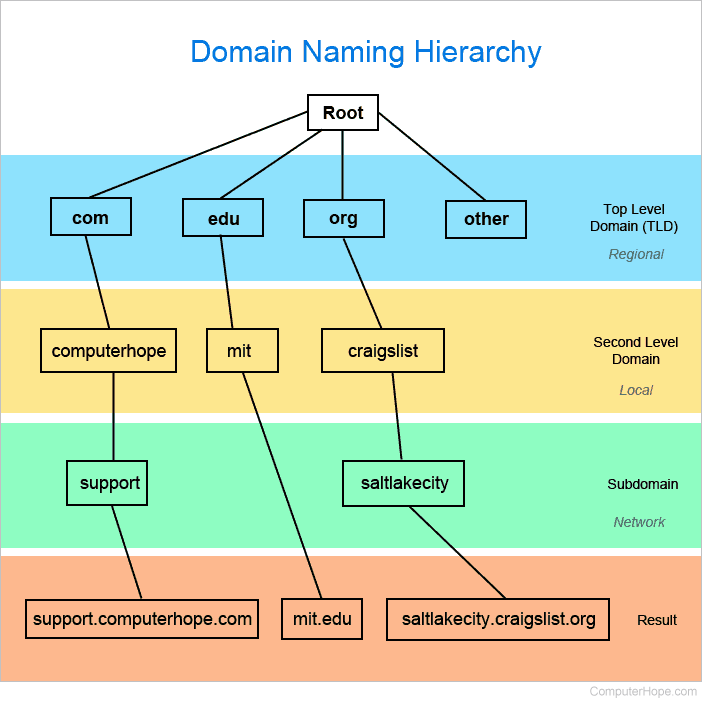
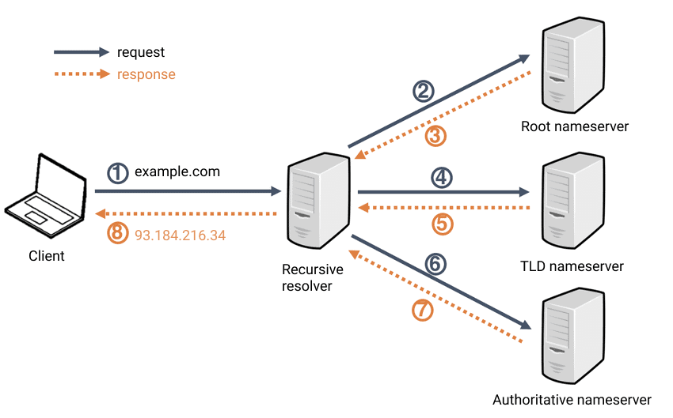
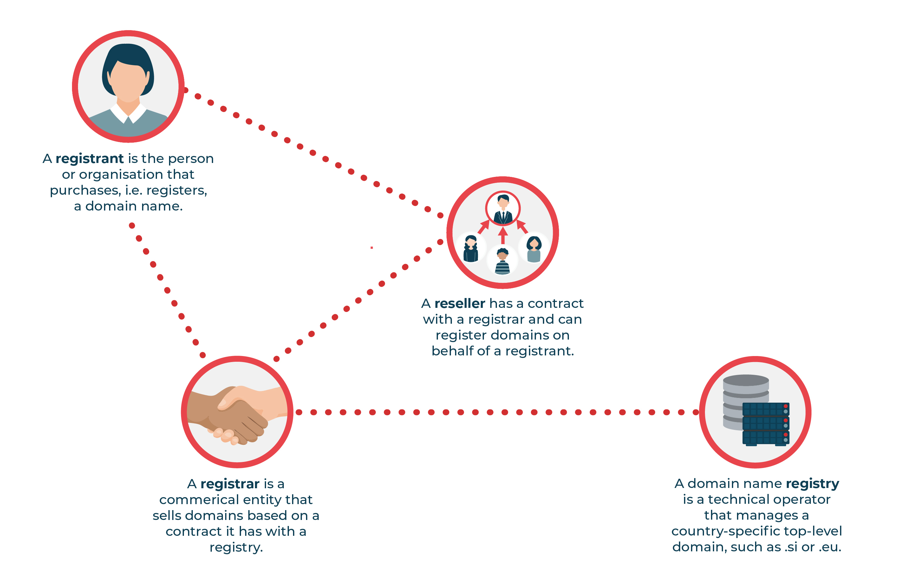

# DNS - Domain Name System

1. Port
    - 53

2. Warstwa OSI
    - 7 (aplikacji)

3. Szczegóły
    - 

    * Działanie
        - Tłumaczy nazwy domen (np. google.com) na odpowiadające im adresy IP (np. 142.250.186.110)

    * Funkcje
        1. Name Space
            - DNS zapewnia hierarchiczną i zorganizowaną przestrzeń nazw dla identyfikacji zasobów w sieci.
            
            

        2. Name Resolution
            - Funkcja ta pozwala klientom na odpytywanie serwerów DNS w celu przetłumaczenia nazwy domeny na odpowiadający jej adres IP.

            

        3. Name Registration
            - Rejestracja nazw domen jest procesem, który umożliwia dodawanie nowych nazw domen do globalnego systemu DNS.

            

        4. Data Storage
            - A record
                - Mapuje nazwę hosta na adres IPv4. To najczęściej używany rekord.

                - Linux:
                ```
                dig -t a example.com
                ```

                - Windows:
                ```
                nslookup -type=a example.com
                ```

            - AAAA record
                - Mapuje nazwę hosta na adres IPv6.

                - Linux:
                ```
                dig -t aaaa example.com
                ```

                - Windows:
                ```
                nslookup -type=aaaa example.com
                ```

            - CNAME (Canonical Name Record) record
                - Tworzy alias jednej nazwy domeny do drugiej.
                - Mapuje poddomeny do ich APEX domeny

                - np: **www.example.com** &rarr; **example.com**

                - Linux:
                ```
                dig -t cname example.com
                ```

                - Windows:
                ```
                nslookup -type=cname example.com
                ```

            - MX (Mail Exchange Record) record
                - Wskazuje serwery pocztowe odpowiedzialne za przyjmowanie wiadomości e-mail dla danej domeny.

                - np: example.com &rarr; mail.example.com (priorytet 10)

            - NS (Name Server Record) record
                - Określa autorytatywne serwery nazw dla danej domeny

                - np: example.com &rarr; ns1.example.com, ns2.example.com

                - Linux:
                ```
                dig -t ns example.com
                ```

                - Windows:
                ```
                nslookup -type=ns example.com
                ```

            - TXT (Text Record) record
                - Przechowuje dowolny tekst. Często używane do weryfikacji domen (np. dla SPF, DKIM, DMARC w celu zabezpieczenia poczty e-mail).

                - np: example.com &rarr; "v=spf1 include:_spf.google.com ~all"

                - Linux:
                ```
                dig -t txt example.com
                ```

                - Windows:
                ```
                nslookup -type=txt example.com
                ```

            - SOA (Start Of Authority) record
                - Określa autorytatywny charakter oraz zawiera kluczowe parametry zarządzania i synchronizacji danych między serwerami DNS.

                - Linux:
                ```
                dig -t soa example.com
                ```

                - Windows:
                ```
                nslookup -type=soa example.com
                ```

            - PTR (Pointer Record) record
                - Służy do odwrotnego tłumaczenia, zamieniając adres IP na odpowiadającą mu nazwę domenową, co jest kluczowe dla rewersyjnego DNS.

                - Linux:
                ```
                dig -x ptr <adres ip>
                ```

                - Windows:
                ```
                nslookup -type=ptr <adres ip>
                ```
                - lub 

                ``` 
                nslookup <adres ip>
                ```

        5. DNSSEC
            - DNS Security Extensions
            - Zestaw rozszerzeń do DNS, które zapewniają bezpieczeństwo poprzez cyfrowe podpisywanie rekordów DNS. Zapobiega to atakom takim jak zatruwanie pamięci podręcznej DNS (DNS Cache Poisoning), gdzie atakujący próbują podstawić fałszywe rekordy DNS, przekierowując użytkowników na złośliwe strony.

4. DNS RCODES (Response Codes)
    - 

    - Działa
        - 0
        - NoError
        - No Error

    - Unable to interprate query
        - 1
        - FormErr
        - Format Error

    - Unable to process query
        - 2
        - ServFail
        - Server Failure

    - Domain Name from query not Exists
        - 3
        - NXDomain
        - Non-Existent Domain

    - Domain Server doesn't support this kind of query
        - 4
        - NotImp
        - Not Implemented

    - Query Refused
        - 5
        - Refused
        - Query Refused

5. DNS Header
    - 

    - ID
    - FLAGS (query type)
        - QR (Query(0) / Reply(1))
        - OPCODE (Query Code) -  QUERY (standard query, 0), IQUERY (inverse query, 1), or STATUS (server status request, 2)
        - AA (Authorative Answer)
        - TC (TrunCation)
        - RD (Recursion Desired)
        - RA (Recursion Available)
        - Z (Zero)
        - AD (Authentic Data)
        - CD (Checking Disabled)
        - RCODE ([Response code](#dns-rcodes-response-codes))
    - QDCOUNT / ZOCOUNT
    - ANCOUNT / PRCOUNT
    - NSCOUNT / UPCOUNT
    - ARCOUNT

6. Security
    - 

    - Cache Poisoning Attack
        - Man in the middle attack

        - DNS server hijacking

        - client machine hijacking

        - Birthday attack

        * **Obrona**
            - DNSSEC
            - DNS over HTTPS
            - DNS over LTS
            - DNS software update
            - Endpoint security

    - NXDomain Attack
        * **Obrona**
            - Czystka cache
            - Blokada "spamujących" adresów IP
            - Rate limiting
            - Response Policy Zones

    - Query Flood Attack

        * **Obrona**
            - Rate limiting
            - Cache-Only dns
            - Antycast
            - Firewall / antyDDos
            - loadbalancer
    
    - Phantom Domain Attack
        * **Obrona**
            - Rate limiting
            - Restricting recursive queries per server and zone
            - Strong Authentication