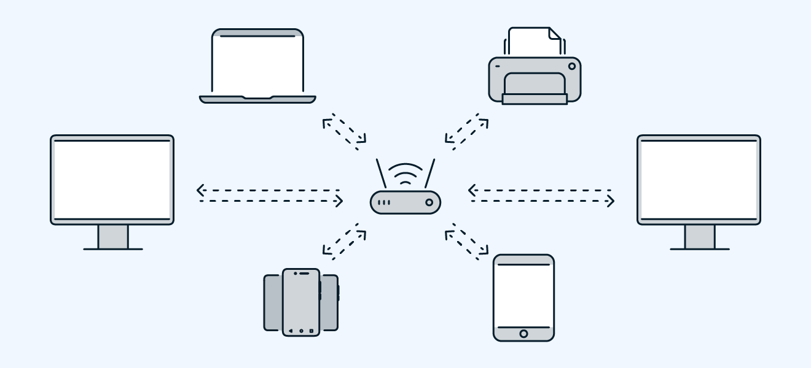

# LAN - Local Area Network

1. Opis
    - 

    - To grupa połączonych ze sobą urządzeń (komputerów, drukarek, serwerów itp.) znajdujących się na stosunkowo małym, ograniczonym obszarze geograficznym, takim jak dom, biuro, szkoła 
    - Łatwe do zaplanowania *oraz mozliwej naprawy*

2. Wizualizacja
    